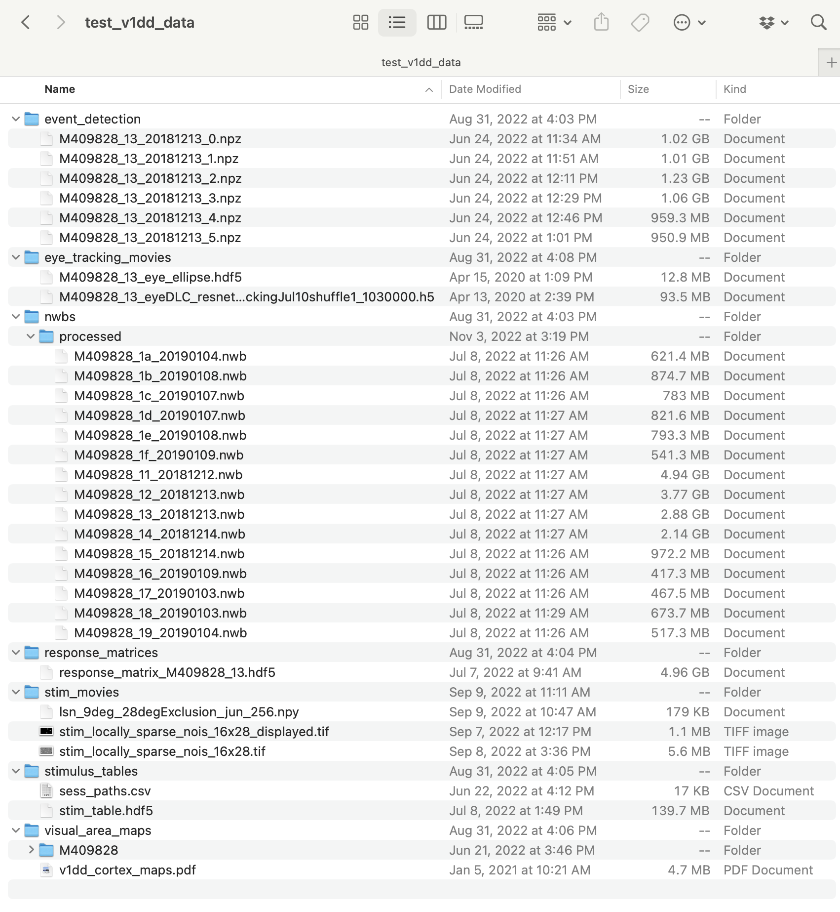

# Allen Institute V1DD SDK
*Primary Author:* Chase King ([iamchaseking@gmail.com](mailto:iamchaseking@gmail.org), now at Columbia)

# Directory structure
Inside the [`src/allen_v1dd`](src/allen_v1dd) directory is the source code for the `allen_v1dd` package. I currently have things structured so general-purpose data processing and analysis is in this folder, and notebooks are stored externally (e.g., mine are in [`chase/analysis`](chase/analysis), outside of the package root directory). I generally use these notebooks for experimenting or analyzing the outputs of things from the `allen_v1dd` package, and then can port new features (e.g., certain stimulus analyses) into the package.

# Saving analyses (`stimulus_analysis.h5`)
See [`scripts/stim_analyses.md`](scripts/stim_analyses.md) for a walkthrough on executing these scripts.

# Example notebooks
For examples, see the notebooks in the [`example_notebooks`](example_notebooks) folder.

# Using this library
## (1) Download repository
First `cd` to wherever you want your local copy to be stored. Then run
```
git clone git@github.com:AllenInstitute/allen_v1dd.git
cd allen_v1dd
```
This will close this git repository into the `allen_v1dd` folder.

## (2) Creating conda environment
The environment I use is called `allen_v1dd` and is saved in `environment.yml`. To create a conda env from this file, run (from the main directory)
```
conda env create -f environment.yml
```
If you are having trouble building from the `environment.yml` file, then create a new conda python environment; I am specifically using Python 3.10.9:
```
conda create -n allen_v1dd python=3.10.9
```
Now that the environment has been created, run the following commands to install dependencies:
```
conda activate allen_v1dd
python -m pip install --upgrade pip
pip install -r requirements.txt
```

## (3) Install the `allen_v1dd` package locally
From within the parent directory, `allen_v1dd`, run
```
pip install -e .
```
If everything installed correctly, you should see: `Successfully installed allen-v1dd-VERSION`

## Obtaining the data
You will need access to the V1DD 2-photon optical imaging ("ophys") data; there are two approaches outlined below.

### Option 1: `/allen/` drive folder
You can use the `/allen/` drive folder if you are in the building or have SSH access to a computer in the building (ask Michael if you need this). Anecdotally I have had some latency issues using this method, and have experienced longer loading times for files. The path for the V1DD data (if on Mac) is
```
/allen/programs/mindscope/workgroups/surround/v1dd_in_vivo_new_segmentation/data
```
If you are creating a `allen_v1dd.client.OPhysClient` and want to use this directory, you can pass no parameters, i.e., `client = OPhysClient()`.

### Option 2: Local data copy
This is the approach I personally use as I primarily work from home and it's nice to keep a copy of data locally for easy and faster access. For reference here is the folder structure of my local V1DD data. It is 32.7 GB total. I only have downloaded files for mouse 409828 (aka the "golden mouse", since it was the one that was selected for EM). Then just pass the file path of this directory into `OPhysClient`.



# Internal file locations
 - Documents (incl. Reza white paper): `/allen/programs/mindscope/workgroups/surround/v1dd_in_vivo_new_segmentation/docs/`
 - Reza's white paper figure source code: `/allen/programs/braintv/workgroups/v1column/rezaa/deepdive_volumes/code/v1dd/notebooks/white_paper_figures.ipynb`
 - Reza’s analyses: `/allen/programs/braintv/workgroups/v1column/rezaa/deepdive_volumes`
 - New segmentation data files: `/allen/programs/mindscope/workgroups/surround/v1dd_in_vivo_new_segmentation/data`
 - Volume imaging 2P analysis (Jun’s (now defunct) analysis library): `/allen/programs/mindscope/workgroups/surround/v1dd_in_vivo/volume_imaging_2P_analysis/volume_imaging_2P_analysis/`
 - Jun’s old analyses: `/allen/programs/mindscope/workgroups/surround/v1dd_in_vivo/work_plots/`
 - LSN stimulus file: `/allen/programs/braintv/workgroups/nc-ophys/VolumeImaging/V1DD_volumestim2/movies/lsn_9deg_28degExclusion_jun_256.npy`

# Original data
Jun's data (the nwb files we are loading here) is built from the original data. The process of locating the original data for a given session is a bit lengthy since sessions need to be mapped to a "prodXX" folder (e.g., "prod55") within braintv. First, navigate (or `cd`) to
```
/allen/programs/braintv/workgroups/v1column/rezaa/deepdive_volumes/code/v1dd/config
```
You should see the following files:
```bash
> ls

deepdive_EM_volumes_393809_specs.json  deepdive_EM_volumes_416296_specs.json  deepdive_EM_volumes_438833_specs.json  deepdive_EM_volumes_params.json
deepdive_EM_volumes_409828_specs.json  deepdive_EM_volumes_427836_specs.json  deepdive_EM_volumes_mouse_ids.json     deepdive_EM_volumes_path.json
```
Next open (or `cat`) the `deepdive_EM_volumes_mouse_ids.json` file. Find the corresponding `prod` ID for the mouse. Suppose we want to find the original data for mouse 409828, column 1, volume 3. This file indicates these data are stored in `prod55`. Next, open (or `cat` in bash) the file `deepdive_EM_volumes_......_specs.json` (where dots indicate the mouse ID; e.g., `cat deepdive_EM_volumes_409828_specs.json`). The keys in this JSON file indicate the column and volume, concatenated with no joining character. In our example, we want `"13"` (e.g., column 1, volume 3). The dictionary value at this key contains the `"session"` information, which in our example is `794964451`. The specimen values should all be the same in a given file, which in our example is `734689833`. Thus, the data for this session are stored in
```
/allen/programs/braintv/production/neuralcoding/prod55/specimen_734689833/ophys_session_794964451
```
This has the files
```bash
> ls

201812131821_DEEPSCOPE_SESSION_UPLOAD_QUEUE_794964451.log        deepscope_session_upload_input.xml
201812131911_IMAGE_ZOOMIFY_QUEUE_795023849.log                   DEEPSCOPE_SESSION_UPLOAD_QUEUE_794964451.pbs
201812131911_IMAGE_ZOOMIFY_QUEUE_795023857.log                   eye_tracking
201910052048_EYE_TRACKING_TO_SCREEN_MAPPING_QUEUE_794964451.log  EYE_TRACKING_TO_SCREEN_MAPPING_QUEUE_794964451_input.json
201911221522_EYE_TRACKING_TO_SCREEN_MAPPING_QUEUE_794964451.log  EYE_TRACKING_TO_SCREEN_MAPPING_QUEUE_794964451_output.json
794964451_platform.json                                          EYE_TRACKING_TO_SCREEN_MAPPING_QUEUE_794964451.pbs
794964451_reticle_downsampled.aff                                IMAGE_ZOOMIFY_QUEUE_795023849_output.txt
794964451_reticle_downsampled.tif                                IMAGE_ZOOMIFY_QUEUE_795023849.pbs
794964451_reticle.tif                                            IMAGE_ZOOMIFY_QUEUE_795023857_output.txt
794964451_stim.pkl                                               IMAGE_ZOOMIFY_QUEUE_795023857.pbs
794964451_sync.h5                                                ophys_experiment_795018534
794964451_vasculature_downsampled.aff                            ophys_experiment_795018546
794964451_vasculature_downsampled.tif                            ophys_experiment_795018557
794964451_vasculature.tif                                        ophys_experiment_795018568
794964451_video-0.avi                                            ophys_experiment_795018579
794964451_video-1.avi                                            ophys_experiment_795018590
```
More generally, the file location is
```
/allen/programs/braintv/production/neuralcoding/prod../specimen_........./ophys_session_.........
```

# Porting from old SDK
There are a few major changes made to this version. For example usages, please refer to the notebooks in the [`example_notebooks`](example_notebooks) folder.

1. **Easier imports.** Clients can be imported using `from allen_v1dd.client import OPhysClient`, for example, rather than having to rely on adding folders to the system path.
    - `V1DDClient` changed to `from allen_v1dd.client import OPhysClient`.
    - `V1DDEMClient` changed to `from allen_v1dd.client import EMClient`.
1. **Xarray data storage.** Instead of using numpy array for storing traces (e.g., dF/F or event traces), we are using xarrays. Check out the [xarray documentation](https://docs.xarray.dev/en/stable/) for more details. Here is what is changed:
    - Accessing traces: `session.get_traces(plane, trace_type)` no longer return a (traces, timestamps) tuple; the traces are returned as an xarray with dimensions (roi, time) and the time dimension is indexed by the timestamps (units of seconds). 
    - ROI full traces: `trace[roi]` changed to `trace.sel(roi=roi)`.
    - ROI time-indexed traces: `trace[roi, frame_start:frame_end]` changed to `trace.sel(roi=roi, time=slice(time_start, time_end))` (where time is in seconds).
        - If you need to use frame indices, then a time index can be obtained using
        ```
        time_idx = trace.indexes["time"].get_loc(frame)
        trace = traces.sel(roi=roi).isel(time=slice(time_idx, time_idx+6)) # isel for index select
        ```
    - Other important note: xarray methods like mean that return a scalar are often returned as `xarray.DataArray` objects. To obtain the value, either cast it in `float` or call `.item()`. This is somewhat annoying but important to be aware of.